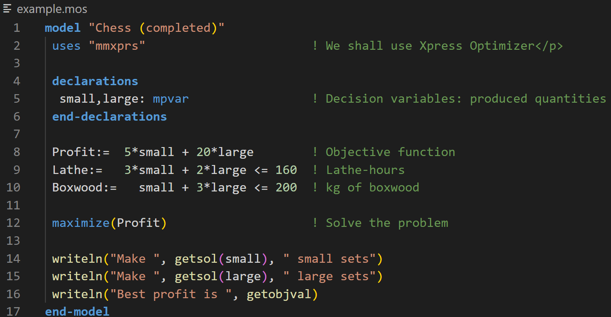

# mosel-support 

This extension allows to add syntax highlighting for x-press mosel language.
* [fico](https://www.fico.com)
* [mosel](https://www.fico.com/fico-xpress-optimization/docs/latest/moselquickref/dhtml/secmoselqr2.html)

To enable the syntax highlighting for your file, you need to name it with the .mos extension.

**Enjoy!**
